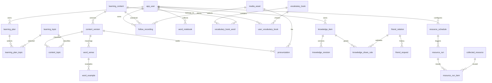

# 知行日课 V3.15 数据库设计说明

版本：V3.15；日期：2026-09-18。适用于 MySQL 5.7.25。依据 V3.15 需求、46张小程序页面和功能流程文档整理。本版将 V3.0 空库基线、V3.1 学段与基础素材、英语多词库扩展合并为一套最终交付；已完成结构与文档一致性静态校验，未连接或修改业务数据库。

## 1 交付与使用顺序

1. 先阅读本说明中的模块关系、事务和迁移规则。
2. 历史 V3.15 字段字典已并入[统一 HTML 字段字典](../数据字典/知行日课_数据库字典_V3.16.html)；本说明保留当时 77 张表、924 个字段的版本记录，当前字段与索引以统一字典为准。
3. 全新空库使用[数据库初始化SQL](../SQL/知行日课_数据库初始化_V3.15_MySQL5.7.25.sql)。脚本不创建数据库，执行人须先选择正确空库；脚本建立77张表，写入必要基线、V3.1基础素材与英语词库定义。演示数据默认关闭。
4. 已有数据库不得直接运行空库初始化脚本。升级前必须备份，在副本中根据[机器可读结构](知行日课_数据库结构_V3.15.json)生成并评审差异迁移，完成回填与回滚演练后再进入维护窗口。
5. 本版机器可读结构与最终 SQL 保留 V3.15 快照；HTML 字典已合并为后续统一版本。R1原43表保留，V3.0新增19表，V3.1/V3.9新增3张词书表；V3.8新增7张记忆训练表，V3.12新增AI模型配置表，V3.13新增TTS日志表并扩展content_version，V3.14新增短文点词词汇表；V3.15新增follow_recording跟读录音表并扩展media_asset用途，另纳入app_parameter运行参数表。

## 2 模块与数据归属

| 功能块 | 主表与新增关系 | 页面 |
| --- | --- | --- |
| 注册与资料 | app_user、user_consent、invite_code、auth_session；手机号复用mobile，头像复用avatar_url | U13、U16、U41—U43、U46 |
| 学习主题与计划 | learning_topic、learning_plan_topic、content_topic；保留learning_plan版本、daily_package及daily_task | U01、U14、U21 |
| 技术内容与学习 | learning_content、content_version、learning_record、learning_event | U02、U03 |
| 英语 | word_sense、word_example、pronunciation、word_notebook；vocabulary_book、vocabulary_book_word、user_vocabulary_book管理词库；熟悉度在learning_record | U04、U05、U31—U33、U40及V3.1新增状态 |
| 媒体与附件 | media_asset、knowledge_asset、follow_recording；跟读录音使用OSS私有对象、本人鉴权和短时签名地址 | U05、U29、U34、U42 |
| 收藏 | user_favorite，多态目标区分技术、词条、短文、资源与摄影 | U30 |
| 复盘与知识 | daily_journal、journal_revision、knowledge_item、knowledge_revision、knowledge_tag | U06—U08、U22—U24、U29、U34 |
| 复习与成长 | review_schedule、review_feedback及修订；weekly_summary、weekly_revision、weekly_action | U09—U12 |
| AI | ai_job、ai_attempt、预算、配额及并发保护表；共用background_job和api_idempotency | U17—U20 |
| 好友 | friend_relation、friend_request、user_inbox_event | U35—U37、U43—U45 |
| 共享 | knowledge_item.visibility、knowledge_share_rule；关系代数防止旧授权复活 | U38、U39 |
| 定时资源 | resource_schedule、resource_schedule_source、resource_run、collected_resource、resource_run_item | U25—U28 |
| 隐私与管理 | 原导出、删除、通知、反馈、审计表扩展业务覆盖范围 | U15及Web管理端 |


## 2.1 V3.15 跟读录音边界

- `follow_recording`仅保存录音归属、短文及版本、时长、状态和`media_asset`引用，不在数据库保存音频二进制或永久签名URL。
- `media_asset.purpose=follow_recording`时对象位于OSS私有Bucket；读取必须先校验当前会话用户等于`owner_id`，再生成短时签名地址。
- 同一`owner_id + content_id`唯一。上传新录音先写入新媒体，再替换关系并退役旧媒体；用户删除时将关系和媒体标记删除并请求删除OSS对象。
- 上传前必须存在最新的`user_consent.purpose=follow_recording_upload`且决定为`grant`。撤回只阻止后续上传；已有录音仍由本人访问并可主动删除。

## 3 核心关系图



关系图只展示核心关系，完整逻辑引用见字段字典。friend_relation的两个用户字段均指向app_user；knowledge_share_rule.friend_id指向被授权者。多态收藏由target_type决定目标表，不能把不同类型ID直接互查。物理外键未启用，写入服务和清理任务必须校验引用。

## 4 字段规则与存储原则

### 4.1 身份和资料

- 微信身份唯一键保持(wx_app_id, wx_open_id)，手机号或昵称不替代账号身份。用户ID32位小写十六进制，不可由客户端自行指定。
- mobile保存授权核验后的规范化国际格式，资料接口禁止更新；mobile_bound_at记录授权时间。只允许注册/历史补授权专用服务首次绑定。历史手机号不能无证据标记为微信已授权。
- 手机号搜索规范化后精确匹配，只返回最小公开账号信息；不向搜索者或好友返回手机号。手机号不设置全局唯一，避免擅自合并不同微信账号；出现多个合法账号时展示脱敏候选并按用户ID申请。
- 昵称默认来自注册确认流程，可编辑；新注册必填1—30字符。空库列默认空字符串只用于结构兼容，业务禁止保存空昵称。既有库完成清理后再收紧为NOT NULL；不能用虚构微信昵称填充历史数据。
- profile_visibility是字段到private/friends/public的映射，只允许预定义字段；缺省private。昵称、头像与账号ID是搜索的最小公开资料。真实姓名、英语名字、生日、性别、爱好、自我介绍按映射返回。手机号永远排除在公开映射之外。
- hobbies_json保存去重字符串数组；建议上限10项，每项20字符，自我介绍500字符。这些属于本版补充的统一输入约束。
- 生产环境应限制mobile列读取、关闭敏感SQL参数日志、加密数据库磁盘与备份；导出只允许本人验证后下载。加密存储若改为字段级密文，应另加加密版本及精确检索摘要字段，不能直接把密文塞入VARCHAR(20)。本版SQL不伪称已实施字段级加密。

### 4.2 主题与版本

- 系统主题scope_key=system，owner_id为空；个人主题scope_key=用户ID，owner_id为本人。用户只能选择系统启用主题和本人主题。
- 系统和个人同名主题优先复用可见系统主题；个人作用域内规范名称唯一。主题数量不固定为AI和计算机基础；每项名称1—50字符。
- 空库初始化使用保留ID写入AI和计算机基础两个起始系统主题，以及最多20名受邀用户的trial计数行。0开头ID列为系统保留段，业务随机ID生成器必须排除。
- learning_plan_topic绑定具体计划版本；content_topic绑定内容版本，不污染历史版本。V3不再按topic_mask过滤，旧位图仅为迁移来源。
- 个人自定义主题不自动把公共内容归类；尚无匹配内容时显示缺项，可按权限管理内容分类或选择其他主题，不虚构学习任务。

### 4.3 词义 词库 发音 收藏

- 一个content_version对应多个word_sense，按sort_no展示，每一词性下可有多个释义；例句绑定具体词义。context仅有名词时不能为演示硬造动词。
- `learning_content.stage`仅用于 word 类型的基础学段筛选，取值为primary、junior或senior；大学、考研、留学与通用词库归属由词库成员关系表达，不继续扩张单值学段字段。
- vocabulary_book保存词库元数据，vocabulary_book_word保存词库与统一单词的多对多关系；同一单词可同时属于高中、CET-4、CET-6或其他词库，词义、例句与音频不复制。user_vocabulary_book只记录用户选库和每日新词目标，学习事实仍落在原学习与复习表。
- pronunciation.target_key固定word或sense:词义ID或example:例句ID；sense_id/example_id与target_key必须一致，且例句所属词义必须属于同一个content_version。uk/us区分口音；一个目标每种口音至多一条。
- record等异词性读音使用sense目标；通用word目标仅用于读音一致的词条。英语短文的article_blocks存段落原文、译文和关联词条ID，高亮词点击定位稳定词条；不能从译文文本猜测关联。
- 发音资源必须ready才可播放，缺失显示不可用；音标、口音、例句文本与内容版本同时切换。媒体链接按访问权限临时签发，数据库不存过期签名URL。
- 熟悉度0—100为自评；保存带learning_record.version_no，不把60%直接改成复习阶段。生词本加入/移除不删除词条、学习记录或独立复习计划。
- 收藏软状态active/removed。target_type=content/word/article指向learning_content，resource/photo指向collected_resource，knowledge指向knowledge_item。技术/英语/短文类别需与目标content_type再次一致。收藏原文不复制正文，失效目标显示不可用，取消收藏不删除知识笔记。

### 4.4 原文和个人笔记

- content_version和被引用knowledge_item不被“做笔记”更新；新笔记写入新的knowledge_item，来源为source_content_id/source_content_version_id或note_parent_id。
- 笔记正文与原文用UI颜色区分。共享时只共享本人笔记字段；不可把私有复盘原文、AI输入或不具备授权的引用正文嵌入返回。
- draft状态允许未完成表单暂存；active状态新建笔记要求标题1—100、正文1—10000字符。图片使用结构化引用或安全标记，检索字段仅由服务端生成；不直接渲染任意HTML。
- knowledge_asset只允许关联本人可用图片，关联数量、文件大小与MIME按PRD约束；删除知识时清理引用，不删除仍被合法引用的资源。

## 5 双用户好友事务

### 5.1 发起申请

1. 认证A，按ID/手机号/昵称搜索定位目标B的稳定ID；禁止自己、停用、注销目标。
2. 按ASCII字典序得到user_low_id/user_high_id，创建或读取唯一friend_relation行，事务内锁定它。锁顺序固定，避免A→B与B→A死锁。
3. active则返回已是好友；存在pending则返回同一申请。如果待处理申请来自B，提示A去处理收到的申请，不能自动同意。
4. 新建friend_request，remark必填，state=pending，pending_slot=1；唯一(relation_id,pending_slot)保证最多一条待处理。
5. 同事务写入B的user_inbox_event，提交后返回request_id/state/version。网络重试复用api_idempotency。通知推送可异步，站内待处理记录是最终依据。

### 5.2 同意和拒绝

接收人B才可决策。事务内按关系行→申请行顺序锁定，校验双方有效、接收人、expected_version及pending。

| 操作 | 申请更新 | 好友关系 | 通知与结果 |
| --- | --- | --- | --- |
| 同意 | accepted、pending_slot=NULL、decided_at、版本加1 | state=active，generation加1，accepted_at；一次事务只建立一次 | A收到accepted；B列表已处理；双方好友列表出现对方 |
| 拒绝 | rejected、pending_slot=NULL、decided_at、版本加1 | 保持none或removed，不增加关系代数 | A收到rejected；B列表已处理；不开放共享 |
| 目标失效 | invalid、pending_slot=NULL、decided_at | 不建立关系 | 返回账号不可用，已处理列表展示失效 |

重复同意、重复拒绝返回既定结果，不再次加generation。并发相反决策只有首次成功；后续返回409及当前状态。站内通知event_key唯一，避免重复红点。

拒绝后A主动重新申请生成新request_id；旧记录只读保留。频率建议同一对用户24小时内最多3次申请，按可配置规则校验，拒绝不触发自动重试。本版未定义好友申请自动过期，因此不增加无依据的过期时间；未来引入需同时补状态与用户提示。

### 5.3 解除好友

流程补充功能：任一方确认后state=removed，更新版本及removed_at；使双方pending申请失效，双方授权立即按关系状态失效。再次同意增加generation；原selected授权不会因重新成为好友自动恢复。取消关系不删除另一方本人知识。

“分享邀请”使用服务端签名且有有效期的邀请参数，包含邀请人ID、签发时间和用途；验签后只引导到申请确认，不直接创建关系。邀请人失效、参数过期或准入未完成时提示对应状态。可先采用无状态签名，不复用试用邀请码作为好友关系凭据。

## 6 知识读取权限

任何列表、详情、分享链接、图片地址和收藏详情都执行同一判断。先校验知识state=active、双方账号可用；作者本人可读写。非作者只能读，不允许修改、删除或对方AI处理。

```text
private  → 非作者拒绝
friends  → 当前active好友 且没有对此friend的deny规则
selected → 当前active好友 且allow规则的relation_id与generation匹配
```

- 保存U38必须在同一事务更新visibility及规则，带knowledge_item.version_no。private清空此知识分享规则；selected重建当次选中的allow且至少一人；friends只保留用户明确确认的排除名单。模式切换不得意外沿用旧allow/deny。
- U39取消对单一好友共享：selected删除对应allow；如果最后一位被移除，自动改private。friends写deny，其他好友继续可读；UI提供排除名单管理和取消排除。此为闭环补充规则。
- friends天然覆盖以后新加好友；deny在显式取消前保留。再次加好友的selected授权需重新选择；friends仍按实时好友关系及deny生效。
- 更新权限后清除列表和详情缓存；缓存键包含viewer、知识版本及关系代数，不能只凭knowledge_id命中公共缓存。附件访问也校验引用知识权限，短时URL过期前不宣称物理收回已下载内容。

## 7 定时资源与公共任务

- 学习计划任务daily_task与资源采集resource_run独立；采集失败不扣学习完成率。resource_schedule属于个人，来源必须来自enabled白名单，用户不可任意输入内网地址抓取。
- 每次触发确定配置版本和时间槽，唯一(schedule_id,trigger_key)防重复；配置快照固定关键词、来源、数量和时区。手动重试应复用同run并增加attempt_count，主动“立即执行”用新的manual幂等键创建新run。
- background_job负责租约和调度，resource_run描述业务结果；领取租约成功后运行，超时可回收，重复写结果由唯一键去重。成功/部分成功/失败分开显示。
- 来源逐项出错记录到background_job安全payload或运行错误摘要，不能将私有凭证写入日志。暂停后不产生新运行；已开始运行允许结束，删除任务时取消尚未开始的运行并标记配置deleted。
- dedup_enabled开启时跳过本任务历史已采集资源；关闭后允许不同运行再次出现，同一运行仍去重。topics_json与关键词保存用户关注项；tags_json用于结果分类。热度缺失不造数字，跨来源按各来源排名交替展示，不能直接比较不同量纲的热度分数。
- summary_enabled为资源摘要开关，开启前复用AI预览/同意；新增action_code=resource_summary，仅发送合法公共来源摘要或授权正文，使用相同预算、配额和超时机制。结果存resource_run_item，来源原摘要不变；配额不足或失败回退来源摘要并显示状态。摘要仅作为采集结果附加字段，不自动新建个人知识；关闭或撤回AI同意后不再生成。
- collected_resource保存来源摘要和URL；同canonical_url_hash去重。只有通过本人resource_run_item或合法收藏关联可列入个人结果；“公共资源索引存在”不意味着能列举其他用户采集主题。
- 采集任务采用Asia/Shanghai；网络重试建议最多2次、间隔1分钟和5分钟；这些配置属于本版补充约定，部署时统一配置，避免无限重试。

## 8 旧库迁移步骤

### 8.1 预检查与结构阶段

先备份并在副本演练。实际库可能已追加资料字段，须用information_schema.columns/statistics核对，不能凭“43表”就重复ADD COLUMN。确认昵称空值、手机号格式、JSON合法性、孤儿引用和已有唯一键。MySQL DDL不能依赖事务回滚，执行失败从结构差异清单恢复，禁止盲目重放整个增量文件。

```sql
SELECT COUNT(*) AS missing_nickname FROM app_user
 WHERE nickname IS NULL OR TRIM(nickname) = '';
SELECT table_name,column_name,column_type,is_nullable
 FROM information_schema.columns WHERE table_schema=DATABASE()
 ORDER BY table_name,ordinal_position;
```

在维护窗口执行经评审的差异迁移；与客户端发布协同，新增功能入口未就绪前关闭。昵称NOT NULL收紧单独安排到补齐验收后；其他新列默认值按安全私有/无授权状态回填。历史结构增量文件已从最终目录移除，不得从旧备份中直接取用并盲目重放。

### 8.2 数据回填和读路径切换

| 对象 | 回填方式 | 验证 |
| --- | --- | --- |
| 手机号 | 保留已有值，规范化必须核实区号；仅有真实微信授权证据才填mobile_bound_at；无证据走本人补授权 | 不伪造授权，不把昵称变化映射到身份 |
| 昵称 | 原值保留；空值由下次登录确认，不伪装为真实微信名 | 补齐后非空检查为0，再收紧列 |
| 主题 | 创建system的AI与计算机基础，按旧mask位为每个计划和内容版本回填关系；记录稳定ID映射 | mask=0为空关系，1/2/3分别1/1/2个关系 |
| 旧词义 | 原meaning映射单个词义，无法判断词性用other并标待审核；旧example映射其例句 | 不丢原文，不能自动拆成错误词性 |
| 音频 | 无音频保留不可播放，后续有授权资源才关联 | 不造假URL或默认播放成功 |
| 熟悉度/生词本 | 熟悉度默认NULL，提示尚未自评，与明确自评0%区分；生词本不从“学过”擅自推断 | 加入动作产生独立记录 |
| 收藏 | 原bookmark_content_id且业务确认为收藏的记录映射user_favorite；唯一键去重 | 保留原个人笔记，不因迁移取消收藏而删除笔记 |
| 知识状态 | 既有有效知识active且private；已有草稿如有标识按原状态迁移 | 未授权知识对任何好友不可见 |
| 好友/共享 | 不根据同邀请码、同手机号或互动历史推断；新增关系从明确申请开始 | 初始好友与分享关系为空 |
| 媒体 | 外部旧头像URL保留兼容读取；新上传记录media_asset并使用稳定受控地址 | 不为他人头像伪造owner上传记录 |

回填按批次幂等UPSERT及稳定映射表执行，记录行数、错误行与摘要对比。结构增量未内置以上回填，不可直接切换生产读路径。确认回填后切换主题与词义读取、保留旧字段只读兼容一个发布周期；后续清理另立迁移，不在本次DROP。

### 8.3 回退

新增字段和表先保留，功能开关回退并禁止旧客户端修改V3独有关系。已产生好友/共享数据后，不能回滚到完全不校验共享权限的旧服务。恢复备份前先执行删除墓碑，防止已删除用户数据复活。回退重点是受控停止新功能，不是直接删表。

## 9 删除 导出 保留与运维

- 本人导出新增资料、主题、生词本、熟悉度、收藏、个人采集配置及记录、好友申请与本人授权记录；仅导出本人有权保留的最小他人标识，不打包好友私有资料和共享正文。ZIP仍按原24小时有效期。
- 删除知识先不可访问，再清理授权规则、图片引用、复习、收藏关联及AI临时任务；独立笔记保留本人正文，仅来源标失效。
- 注销账号撤销会话和全部关系，终止待处理申请、采集配置、导出与AI作业；删除本人授权、站内事件、媒体引用、收藏和生词本。对方申请记录脱敏或按删除政策清理，不保留该用户可识别资料。
- background_job增加清理类型而非创建无关联的另一个队列；data_deletion/deletion_step覆盖新增表，deletion_tombstone保护备份恢复。沿用在线24小时清理目标，受备份周期约束的物理清除时间单独展示。
- 站内申请历史与资源运行历史建议保留180天和90天，执行前纳入隐私说明并配置化；待处理申请及必要有效授权不得被普通历史清理误删。该保留周期是补充建议，并非原UI承诺。
- 所有owner从认证上下文取，不接受客户端任意owner_id。后台管理员只见运行元数据、公共内容与安全审计，不可直接读取私有知识、好友申请备注或复盘正文。

## 10 验证清单

| 领域 | 必须通过的验证 |
| --- | --- |
| 结构 | SQL/JSON/HTML表与字段顺序一致；索引字段存在；无重复表字段；逻辑引用有效 |
| MySQL兼容 | 已在5.7.25隔离空实例完整导入；通过utf8mb4索引长度、行宽、JSON字段和初始数据语法验证 |
| 迁移 | 旧43表副本完整回填并比对；二次回填不产生重复关系；结构脚本禁止盲目二次执行 |
| 双用户 | 并发双向申请只产生一个pending；重复同意只建立一次；拒绝不产生active关系；再申请保留旧记录 |
| 共享 | 私有不可读；全体含未来好友；指定仅当前授权代数；撤销、解除好友、注销后旧链接失效 |
| 英语 | 多词性顺序、例句口音与版本一致；重复加入/收藏幂等；自评分与复习阶段独立 |
| 资源 | 同时间槽不重复执行；暂停不新增；部分失败保留成功结果；不能越权查询其他用户配置 |
| 删除 | V3.0新增19表、V3.1新增3表和新增媒体引用均进入清理；备份恢复重放墓碑；所有缓存和签名策略符合权限规则 |

详细页面按钮与验收步骤见需求V3.1和小程序流程Word。以上“建议”参数与S编号界面为开发闭环补充，可调整，但必须同步需求、接口、数据校验和测试用例。


## 11 V3.15 已实现增补

最终结构共 **76 张表、914 个字段**。当前技术知识详情、账号列表和单词详情均复用现有表，不额外增加结构；它们通过管理员鉴权接口读取公共内容或脱敏账号元数据。

| 版本 | 数据变更 | 运行边界 |
| --- | --- | --- |
| V3.8 | word_memory_hint/question/session/episode/hint_event/attempt/evidence | 保存题目版本、提示轨迹、首答与分维度证据；不覆盖原始作答 |
| V3.10—V3.11 | app_parameter计划与学习筛选字典 | 小程序只读取白名单接口，不直接读取参数表；时间和筛选不在页面写死 |
| V3.12 | ai_model_config及DeepSeek模型种子 | 密钥字段只引用app_parameter键；价格为0时禁止调用；小程序不可修改模型 |
| V3.13 | content_version整篇音频字段、tts_usage_log、每级101篇短文 | TTS日志不保存正文和凭据；音频资源关联media_asset |
| V3.15 | article_word_glossary及104条兜底词形 | 正式词库优先；缺少音频可由服务端TTS生成 |

### 11.1 管理端读取边界

- 账号列表只读 `app_user` 的短ID、序号、昵称、脱敏手机号、状态、AI同意状态、最近登录和创建时间；接口不返回 `wx_open_id` 或完整手机号。
- 技术知识详情读取 `learning_content`、`content_version`、`content_topic`、`learning_topic` 与 `content_source`；只展示公共发布内容，不绕过内容审核或授权。
- 单词详情复用 `content_version`、`word_sense`、`word_example`、`pronunciation`、`media_asset` 与 `content_source`；已有音频直接播放，无音频时由管理员触发TTS并记录 `tts_usage_log`。

### 11.2 执行与迁移

- 全新空库只执行V3.15最终初始化SQL；不要再顺序执行同一脚本已合并的V3.8—V3.15增量文件。
- 已有数据库只执行尚未应用的增量迁移。当前新增的技术详情、账号列表和单词详情不需要新SQL。
- V3.12—V3.15已在目标库执行且能查询到相应表/字段时，无需重复执行；可使用information_schema核对后再决定。
- AppKey、AccessKey和AI API Key不写入本最终SQL。敏感值由服务端加密后保存；保存成功不等于云供应商已授权，必须以真实调用验收。

### 11.3 TTS配置验收

阿里云TTS需要AppKey与AccessKey属于同一账号或有效授权链路、已开通上海区域NLS、RAM用户具备令牌与合成权限。供应商返回 `40020503 / No permission` 表示第三方权限未满足，不是数据库保存失败。日志应保留安全错误码和请求ID，但不得记录AccessKey Secret或待合成正文。
